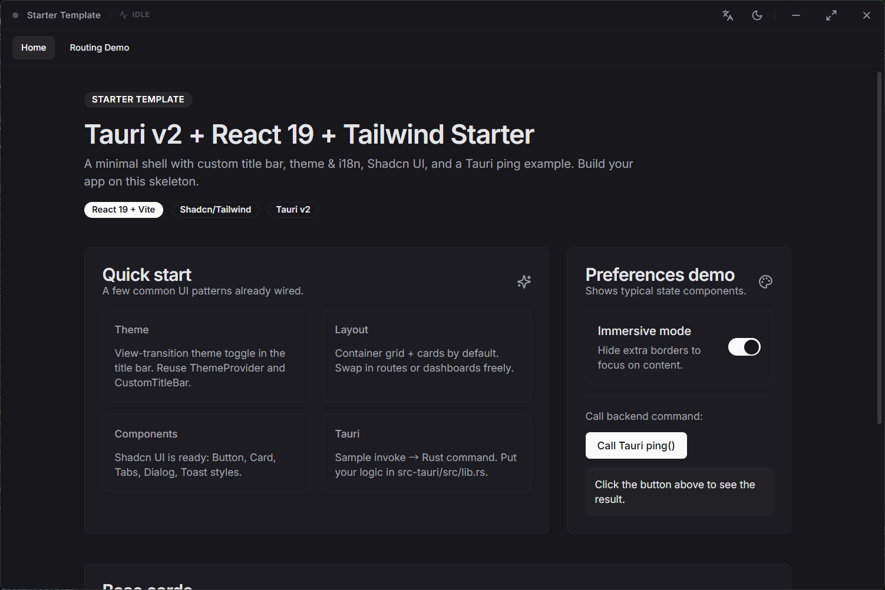

# Tauri + React 入门模板

[English](./README.md)

这是一个基于 **Tauri v2 + React 19 + Vite + Tailwind/Shadcn** 的最小启动模板，去掉了业务逻辑，保留了主题/语言切换、自定义标题栏、Toast 与 Dialog 样式等 UI 骨架，方便直接开始桌面前后端一体化开发。



## 特性
- **自定义标题栏**：支持拖拽、窗口控制按钮、主题切换动画、语言切换。
- **明暗主题 & i18n**：内置 `ThemeProvider` 与 `i18next`，中英文示例文案。
- **路由支持**：已配置 React Router v6 (`HashRouter`) 及示例布局。
- **UI 组件就绪**：Tailwind + Shadcn 组件库（按钮、卡片、对话框、Tabs、Toast 样式）。
- **Tauri 后端**：提供 `ping` 命令演示前后端通信，预置 `tauri-plugin-log` 日志插件。

## 开发
```bash
pnpm install          # 安装依赖
pnpm dev              # 前端开发模式
pnpm tauri dev        # 同时启动 Tauri 桌面应用（推荐）
pnpm build            # 构建前端
pnpm tauri build      # 打包桌面应用
```

## 目录概览
- `src/` 前端代码：
  - `App.tsx`: 主布局组件（标题栏 + 导航 + 子路由出口）。
  - `pages/`: 页面文件 (`Home.tsx`, `Demo.tsx`)。
  - `components/CustomTitleBar.tsx`: 自定义标题栏实现。
  - `components/ui/`: Shadcn 组件集合。
  - `lib/i18n.ts`: 国际化配置。
- `src-tauri/` 后端代码：
  - `src/lib.rs`: 命令处理 (`ping`) 与插件配置。
  - `tauri.conf.json`: 项目配置。

## 下一步
- 在 `src/main.tsx` 中添加新路由，并在 `src/pages/` 创建对应页面。
- 在 `src/App.tsx` 中更新导航链接。
- 在 `src-tauri/src/lib.rs` 新增命令或插件，供前端 `invoke` 调用。
- 保留的 Shadcn/Tailwind 样式可直接复用。
